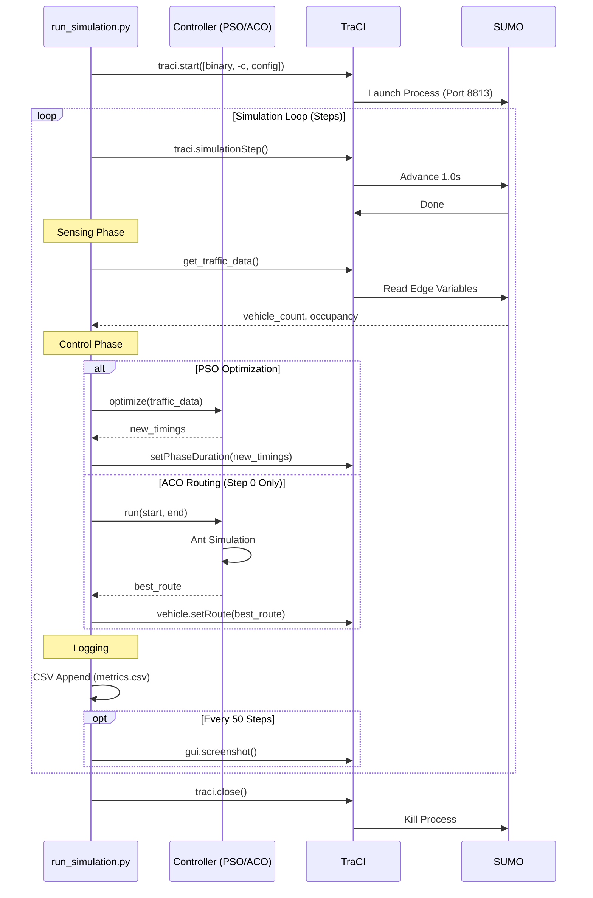

# Swarm Traffic Simulation - Master Project Documentation

> **[AGENTS / LLMS / DEVELOPERS]**: This is the **Source of Truth**. It contains granular details about the implementation, mathematical models, code behavior, and data structures. Read this before attempting ANY code modifications.

---

## 1. Project Ontology & Definitions

To understand this codebase, you must define the following terms in this specific context:

*   **Node**: A graph implementation of a SUMO Junction (Intersection).
*   **Edge**: A graph implementation of a SUMO Road/Lane. Identified by strings like `"-151809046"`.
*   **Controller**: A Python class responsible for a specific domain of optimization (Signals or Routing).
*   **Particle (PSO)**: A vector representing durations (in seconds) for traffic light phases.
*   **Ant (ACO)**: A virtual agent traversing the internal NetworkX graph to find a low-cost path.
*   **Pheromone**: A float value associated with a NetworkX edge, representing its desirability.
*   **TraCI Step**: One atomic unit of simulation advancement (typically 1 second).

---

## 2. System Architecture & Data Flow

### The "Loop" Architecture
The system runs synchronously. Python blocks until SUMO finishes a step, and SUMO blocks until Python finishes its logic.

**Visualizing the `run_simulation.py` Cycle:**



1.  **Initialization Phase**
    *   Python launches `sumo-gui` binary on a specific port.
    *   TraCI connects to this port.
    *   `ACORouting` parses `map.net.xml` into a `networkx.DiGraph`.
    *   `PSOController` is instantiated (stateless).

2.  **Simulation Step Loop (`while True`)**
    *   **STEP 1: Physics**: `traci.simulationStep()`
        *   SUMO moves vehicles, handles collisions, updates traffic lights based on *previous* commands.
    *   **STEP 2: IO/Sensing**: `get_traffic_data()`
        *   **Input**: Query TraCI for all Edge IDs.
        *   **Process**: Loop through edges.
        *   **Output**: Dict `{'edge_id': {'vehicle_count': int, 'occupancy': float}}`.
    *   **STEP 3: Decision (The Brain)**
        *   **PSO Logic**: `controller.optimize_signal_timing(traffic_data)` is called.
            *   *Note*: Currently, this runs a **fresh** PSO optimization from scratch every single simulation step. It does not carry over state. It returns a "best configuration" for the *current* moment.
        *   **ACO Logic**:
            *   *Current Implementation*: Code currently triggers ACO **only at Step 0** for the first trip defined in `map.rou.xml`. It calculates a route and prints it. It is not currently re-routing vehicles dynamically every step.
    *   **STEP 4: Telemetry**:
        *   Aggregates metrics (Avg Vehicle Count, Avg Occupancy).
        *   Appends to `results/logs/metrics.csv`.
        *   Captures Screenshot (every 50 steps) for video generation.

---

## 3. Algorithm Deep Dive (Implementation Level)

### A. Ant Colony Optimization (ACO) (`controllers/aco_routing.py`)

**Model**:
*   **Graph**: Directed Graph (`nx.DiGraph`).
*   **Node**: SUMO Junction ID.
*   **Edge Weight**: Length of the road (meters).
*   **Pheromone**: Initialized to `1.0` on all edges.

**Mathematics**:
The probability $P_{ij}$ of moving from node $i$ to node $j$ is:

$$ P_{ij} = \frac{(\tau_{ij})^\alpha \cdot (\eta_{ij})^\beta}{\sum_{k \in allowed} (\tau_{ik})^\alpha \cdot (\eta_{ik})^\beta} $$

*   $\tau_{ij}$ (**Pheromone**): `self.pheromone[edge]`
*   $\eta_{ij}$ (**Heuristic**): $(1 / \text{weight})^\beta$ (Inverse of distance).
*   $\alpha$ (`alpha=1`): Importance of history.
*   $\beta$ (`beta=3`): Importance of distance (higher means ants greedily prefer short paths).

**Code Execution Logic**:
1.  **Ant Construction**: `num_ants` ants build paths from `start` to `end` node.
2.  **Selection**: Uses `random.choices` based on the probability distribution above.
3.  **Cost**: `sum(edge_weights)` (Total Distance).
4.  **Updates**:
    *   **Evaporation**: multiply all edges by $(1 - \rho)$.
    *   **Deposit**: For edges in path, add $Q / \text{Cost}$.
5.  **Result**: Returns the single `best_path` found after `num_iterations`.

### B. Particle Swarm Optimization (PSO) (`controllers/pso_controller.py`)

**Model**:
*   Uses a simple, localized implementation (Standard PSO 2011-like).
*   **Search Space**: Dimensions = Number of Intersections. Value = Green Light Duration.

**Mathematics**:
Velocity update for particle $i$:
$$ v_{i}(t+1) = w \cdot v_{i}(t) + c_1 r_1 (pBest_i - x_i) + c_2 r_2 (gBest - x_i) $$

*   $w$ (**Inertia**): `0.5` (keeps particle moving in same direction).
*   $c_1$ (**Cognitive**): `1.5` (pull towards own best).
*   $c_2$ (**Social**): `1.5` (pull towards swarm best).
*   $r_1, r_2$: Random variable $[0,1]$.

**Code Execution Logic**:
*   **Inputs**: `traffic_data` (Dict of edge metadata).
*   **Fitness Function**: `np.sum(timings)`.
    *   *CRITICAL IMPLEMENTATION NOTE*: The current fitness function is a **Placeholder**. It sums the timing values. This means the PSO currently optimizes for *lower total signal time*, not for traffic flow. **To make this functional, this function needs to read queue lengths from TraCI.**
*   **Scope**: As noted, `optimize()` re-initializes `particles` and `velocities` every time it is called. It does not "learn" over the course of the simulation; it optimizes instantaneously based on the current call.

---

## 4. File-by-File Technical implementation

### `runs_simulation.py`
*   `start_simulation(algorithm, param)`:
    *   Bootstraps the entire process.
    *   Handles the TraCI connection lifecycle.
    *   **Error Handling**: Catches `traci.exceptions.FatalTraCIError` implicitly via loop break if SUMO dies.
*   `cleanup()`:
    *   Aggressively deletes `results/` artifacts.
    *   **Warning**: Will delete your old video files. Content in `results/` is ephemeral.

### `utils/sumo_utils.py`
*   `get_traffic_data()`:
    *   Uses `traci.edge.getIDList()` -> potentially slow for massive networks (O(N)).
    *   Uses `getLastStepVehicleNumber` -> returns count of vehicles *fully* on the edge.
    *   Uses `getLastStepOccupancy` -> returns % of lane occupied (0.0 to 1.0).

### `dashboard/app.py`
*   **Data Source**: Reads purely from CSV. Does not connect to SUMO.
*   **Grouping**: Uses Pandas `groupby(['algorithm', 'param'])` to aggregate stats.
*   **Visualization**: Looks for images in `results/screenshots` strictly by extension `.png`, `.jpg`, `.jpeg`.

---

## 5. Data Dictionary: `results/logs/metrics.csv`

The primary output artifact. This CSV is appended to step-by-step.

| Column | Type | Description |
| :--- | :--- | :--- |
| `step` | `int` | The simulation step number (starts at 0). |
| `avg_vehicles` | `float` | The average number of vehicles across ALL edges in the network at this step. `sum(veh_counts) / num_edges`. |
| `avg_occupancy` | `float` | The average traffic density (0.0 - 1.0) of ALL edges. `sum(occupancy) / num_edges`. |
| `algorithm` | `string` | The active algorithm used in this run e.g., `"PSO"`, `"ACO"`. |
| `param` | `int` | The hyperparameter value (e.g., number of Particles for PSO, number of Ants for ACO). |

---

## 6. Configuration Reference (`run_simulation.py`)

These constants control the simulation environment. Edit these directly in the python file.

| Constant | Default Value | Description |
| :--- | :--- | :--- |
| `SUMO_BINARY` | `"sumo-gui"` | Switch to `"sumo"` for headless (faster) execution. |
| `CONFIG` | `"sumo_sim/simulation.sumocfg"` | Path to the main SUMO configuration file. |
| `ALGORITHMS` | `["PSO", "ACO"]` | List of algorithms to run sequentially in the parameter sweep. |
| `PARAM_SWEEP` | `[10]` | List of integer parameters to test for each algorithm. |
| `SCREENSHOT_DIR` | `"results/screenshots"` | Folder where temporary screenshots are stored (deleted on cleanup!). |

---

## 7. SUMO Configuration Details

### `sumo_sim/map.net.xml`
The topological backbone.
*   Generated via `randomTrips.py` or `netedit`.
*   Contains logic for **Connections**: Which incoming lane connects to which outgoing lane.
*   Contains **Traffic Light Logic**: Default phases are embedded here unless overridden.

### `sumo_sim/map.rou.xml`
The demand definition.
*   `<trip id="0" depart="0.00" from="..." to="..." />`
*   Defines *when* a car appears and *where* it wants to go.
*   **Crucial**: These IDs (`from`, `to`) must match Edge IDs in `map.net.xml`. Mismatches cause immediate simulation crash.

---

## 8. How to Extend / Modify

### Adding a New Algorithm
1.  **Create File**: `controllers/my_algo.py`.
2.  **Define Class**: Must match the implicit interface (needs an `optimize` or `run` method).
3.  **Update `run_simulation.py`**:
    *   Import class.
    *   Update `ALGORITHMS` list for parameter sweep.
    *   Add logic in `start_simulation`: `elif algorithm == "MY_ALGO": ...`
    *   **Important**: You must decide if your algo runs *Per Step* (like PSO example) or *Per Vehicle* (like ACO example).

### changing the Map
1.  Delete/Move old `sumo_sim/*.xml` files.
2.  Generate new ones (e.g., `netgenerate --grid`).
3.  **Update `simulation.sumocfg`**: Ensure `<net-file>` and `<route-files>` tags point to the new filenames.
4.  **Validate**: Run `sumo -c simulation.sumocfg` manually to check for XML errors before running the Python script.

---

## 9. API Reference

### `controllers.pso_controller.PSOController`
| Method | Params | Returns | Description |
| :--- | :--- | :--- | :--- |
| `__init__` | `num_particles` (int), `num_iterations` (int) | `None` | Initializes swarm parameters. |
| `optimize` | `traffic_data` (dict) | `np.array` | Runs the PSO loop and returns global best timings. |
| `fitness` | `timings` (np.array), `traffic_data` (dict) | `float` | **Placeholder**: Currently sums the timings. Needs override. |

### `controllers.aco_routing.ACORouting`
| Method | Params | Returns | Description |
| :--- | :--- | :--- | :--- |
| `__init__` | `net_file` (str), `num_ants` (int), `alpha`, `beta`, `rho`, `q` | `None` | Parsing the SUMO net file into `self.graph`. |
| `run` | `start_node` (str), `end_node` (str) | `list` | Runs the full ACO simulation to find optimal path. |
| `construct_solution` | `start`, `end` | `list` (Path) | Simulates one ant building a path. |
| `update_pheromone` | `paths`, `costs` | `None` | Updates graph edge weights based on ant success. |

---

## 10. Dependency Analysis (`requirements.txt`)

*   **`sumolib`**: **Essential**. The official Python library for parsing SUMO network files (`.net.xml`). Used by ACO to build the graph.
*   **`traci`**: **Essential**. The Traffic Control Interface. Allows Python to talk to the running SUMO process over TCP.
*   **`streamlilt`**: **Visualization**. Used for `dashboard/app.py`. Not needed for the core simulation logic.
*   **`networkx`**: **Graph Theory**. Used in `ACORouting` to represent the road network easily and find successors.
*   **`numpy`**: **Math**. Used heavily in `PSOController` for vector operations on particles.
*   **`pandas`**: **Data Analysis**. Used in `dashboard/app.py` to read and aggregate the CSV logs.

---

## 11. Troubleshooting & Common Pitfalls

### 1. `traci.exceptions.FatalTraCIError: connection closed by SUMO`
*   **Cause**: SUMO crashed or finished the simulation before Python expected it to.
*   **Fix 1**: Check `sumo_sim/map.rou.xml`. If a vehicle tries to enter a non-existent edge, SUMO crashes.
*   **Fix 2**: Check if `start_sumo()` is calling the correct binary. If you don't have GUI installed, switch `SUMO_BINARY="sumo"` in `run_simulation.py`.

### 2. "Edge not known" Error
*   **Cause**: Mismatch between `map.net.xml` and `map.rou.xml`.
*   **Fix**: Regenerate routes using the **exact same** network file.
    ```bash
    randomTrips.py -n map.net.xml -r map.rou.xml
    ```

### 3. Dashboard Empty / "No metrics found"
*   **Cause**: Simulation crashed before writing to `results/logs/metrics.csv`.
*   **Fix**: Run the simulation manually and watch the stdout for python errors. Ensure `os.makedirs` is not failing due to permissions.

### 4. ACO takes forever
*   **Cause**: Detailed network + high `num_ants`.
*   **Fix**: Reduce `num_iterations` in `controllers/aco_routing.py` or use a smaller map.
